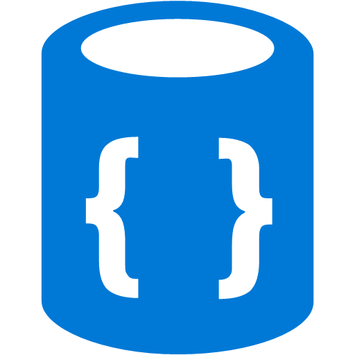

<!-- PROJECT LOGO -->
<br />
<p align="center">
  <a href="https://github.com/lakshyads/dashclicks-backend-zone">
    
  </a>

  <h3 align="center">dashclick_backend_zone</h3>

  <p align="center">
    An awesome README template to jumpstart your projects!
    <br />
    <a href="https://github.com/lakshyads/dashclicks-backend-zone"><strong>Explore the docs »</strong></a>
    <br />
    <br />
    <a href="https://github.com/lakshyads/dashclicks-backend-zone">View Demo</a>
    ·
    <a href="https://github.com/lakshyads/dashclicks-backend-zone/issues/new/choose">Report Bug</a>
  </p>
</p>

<!-- TABLE OF CONTENTS -->
<details open="open">
  <summary>Table of Contents</summary>
  <ol>
    <li>
      <a href="#about-the-project">About The Project</a>
      <ul>
        <li><a href="#built-with">Built With</a></li>
      </ul>
    </li>
    <li>
      <a href="#getting-started">Getting Started</a>
      <ul>
        <li><a href="#prerequisites">Prerequisites</a></li>
      </ul>
    </li>
    <li><a href="#usage">Usage</a></li>
    <li><a href="#original-requirements">Original Requirements</a></li>
    <li><a href="#license">License</a></li>
    <li><a href="#contact">Contact</a></li>
  </ol>
</details>

<!-- ABOUT THE PROJECT -->

## About The Project

A hiring assignment for the role of backend engineer.

### Built With

- [Node](https://nodejs.org/en/)
- [Javascript](https://www.javascript.com/)
- [JSON](https://www.json.org/json-en.html)

<!-- GETTING STARTED -->

## Getting Started

1. Clone the repo
   ```sh
   git clone https://github.com/lakshyads/dashclicks-backend-zone.git
   ```
2. Execute `main.js` to try out the functions
   ```sh
   node main.js
   ```

### Prerequisites

A working installation of [Node.js](https://nodejs.org/en/) is required to run the javascript files.

<!-- USAGE EXAMPLES -->

## Usage

Basic example of importing and using the custom db.

```sh
// Import My_Custom_DB
const my_db = require('./My_Custom_DB');

// Function 1
try {
    var userIds = my_db.function_1('2021-05-24');

    my_db.function_1(123); // Throws Error: Invalid parameters: Expected (string) but found (number)
} catch (error) {
    console.log(error.message);
}

// Function 2
try {
    var userIds = my_db.function_2(3.4, 5);

    my_db.function_3(3.4, '5'); // Throws Error: Invalid parameters: Expected (number, number) but found (number, string)
} catch (error) {
    console.log(error.message);
}

// Function 3
try {
    var unusedSlotsCount = my_db.function_3('fieldId_1', '2021-05-21', '2021-05-29');

    my_db.function_3('fieldId_2', '2021-05-21', 123); // Throws Error: Invalid parameters: Expected (string, string, string) but found (string, string, number)
} catch (error) {
    console.log(error.message);
}
```

<!-- CONTRIBUTING -->

## Original Requirements

### PART 1 - Design a NoSQL database schema

Write a single `JSON` "schema" file to represent the items below in a NoSQL database.

Consider what can be nested versus flattened and related in some other way.

- **Field** - description, directions, field photo urls, gps coordinates, etc.
- **Game** - start time, location, etc.
- **Field Availability Slot** - Typically an hour long slot at a field we have access to schedule a game. This is an exact day and time.
- **User** - name, email, etc.
- **Game Signup** - a user played (or will play) a specific game
- **Game Review** - a user reviewed a game (0-5 stars, comment, etc.)
- **Chat Message** - for both 1. games chats and 2. user to user chats

Here is a starting example schema file (you will want a minimum of 1 dummy item in each collection to demonstrate the schema):

```sh
{
    "fields": {
        "field-id-1" {
            "field_name": "Parc Central",
            ...
        }
    },
    "games": {
        "game-id-1": {
            "field_id": "field-id-1",
            ...
        },
        "game-id-2": {
            ...
        }
    },
    ...
}
```

### PART 2 - Design backend functions

We will write functions to access data from the database you designed in part 1.

1. We want to find users so we can send targeted notifications. We will need to find users based on some criteria by querying the database. These functions should return an array of user ids.
   - **FUNCTION 1:** players who haven't played any games since a given date. Example: all players that haven't played a game since November 18th. \(1 Input: a date; returns: array of user ids\)
   - **FUNCTION 2:** players that have given an average Game Review rating of below x/5 stars for their previous x games played. For example, all players have given an average rating below 3.2 for their last 5 games. \(2 Inputs: avg star rating, num past games; returns: array of user ids)
2. **FUNCTION 3:** A function that returns the number of unutilized `Field Availability slots` for a given field for a given date range. That means any Field Availability slots that did/do not have a `Game` scheduled in that slot during the date range. \(3 Inputs: a field id, start date, end date; output: integer count\)

> ⌨  
> Our backend functions are in Javascript but you can write with pseudo code or in any language style you feel most comfortable.

### Part 3 - Describe additional relational schema

As is common in NoSQL databases you may want to add additional redundant relational schema to support your queries and improve efficiency.
This is to avoid doing large loops over the data and pulling unneeded data into memory when searching for relations.
For this part you will describe what additional schema you could add to the data from Part 1.

You do not need to modify your functions from Part 2 to use this new schema.
You can also assume this relational data will be kept in sync with the "true" data.

```sh
// example of relational mapping in nosql
...
{
    "all_games_at_field": {
        "field-id-1": [
            "game-id-1",
            "game-id-2"
        ],
        "field-id-2": [
        ]
    },
    ...
}
```

<!-- LICENSE -->

## License

Distributed under the MIT License. See `LICENSE` for more information.

<!-- CONTACT -->

## Contact

Lakshya Dev - [linkedIn](https://www.linkedin.com/in/lakshya-dev-502034162) - lakshyadev@live.com

Project Link: [https://github.com/lakshyads/dashclicks-backend-zone](https://github.com/lakshyads/dashclicks-backend-zone)

<!-- MARKDOWN LINKS & IMAGES -->
<!-- https://www.markdownguide.org/basic-syntax/#reference-style-links -->

[license-shield]: https://img.shields.io/github/license/lakshyads/dashclicks-backend-zone?style=for-the-badge
[license-url]: https://github.com/lakshyads/dashclicks-backend-zone/blob/929ea2229b6176311352017286345463c9fbcca9/LICENSE.txt
